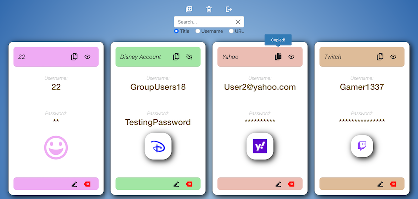
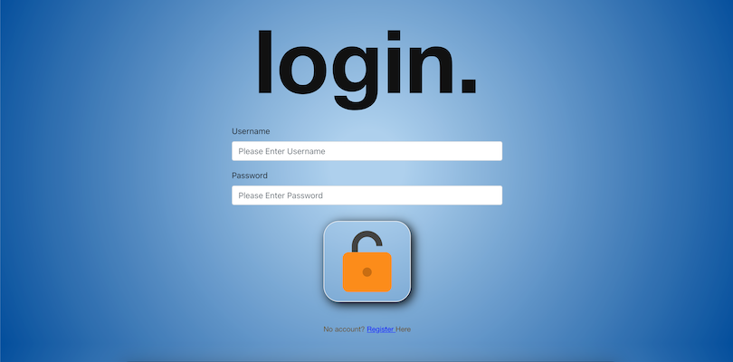

# myVault

myVault is a convenient credential storage web application built with Django and React.js. Video demonstration [here](https://youtu.be/R0eoPqPGfpM).



## Features

- Backend encryption for all usernames and passwords. Username/ Password fields excluded from Admin view.

- CRUD functionality via API from Django to React, secured with Rest Authentication and unique auto-generated Token on account creation.

- Realtime search bar with filters and reset button for quick data retrieval.


- URL storage field to provide users easy navigation via the URL's favicon to where their credentials are required. Copy-to-clipboard functionality for passwords included.

- Input URLS are validated via an async function that checks for a response, informing the user of a bad result and preventing database storage.

- Dynamic form errors that respond to user input in realtime. For responsiveness, if a supplied URL is valid but another field is not, the URL is not checked again unless altered


- Mobile responsive auto-scroll on page-load that centers the articles to the viewport.

- Minimalist design.



## Installation

Install dependencies:

`pip install -r requirements.txt`

Generate unique encryption key:

Open a python shell and execute:

```
import os
import base64

new_key = base64.urlsafe_b64encode(os.urandom(32))
print(new_key)
```

Navigate to /backend/settings.py and set FIELD_ENCRYPTION_KEY = your new_key

In a terminal window, navigate to /backend and execute:

`python3 manage.py makemigrations`

`python3 manage.py migrate`

`python3 manage.py runserver`

to initiate database and start Django server.

In a second terminal window, navigate to /frontend and execute:

`npm start`

to start React.js.

## Files

/backend contains Django project files and /backend/vault contains app files for myVault. /frontend contains React.js files, frontend/src contains the React.js source code for this app, including all CSS and JS files. App.js is the highest order React component which renders each component contained in frontend/src/components. /frontend/src/APIService.js contains all API functions which make calls to /backend/vault/urls.py and are handled by /backend/vault/views.py. APIService.js also contains an async function ValidateUr() which checks for a response from a user URL input and returns a boolean.

## Comments

One feature that could be improved upon is encryption. Currently a single encryption key is used across the app to encrypt all data. Initially my goal was to create a function that generates a unique encryption key for each storage item, based on some combination of the article's data. I was able to directly encrypt and decrypt data this way, however once encrypted data was stored in the database I had some difficulties in decrypting the data again. I assume this is because of how the data is stored and attempting to translate between bytes and string data types.
